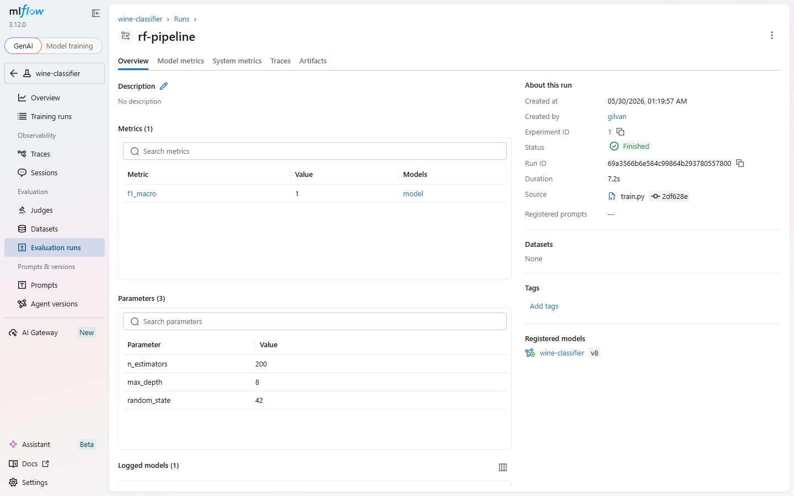
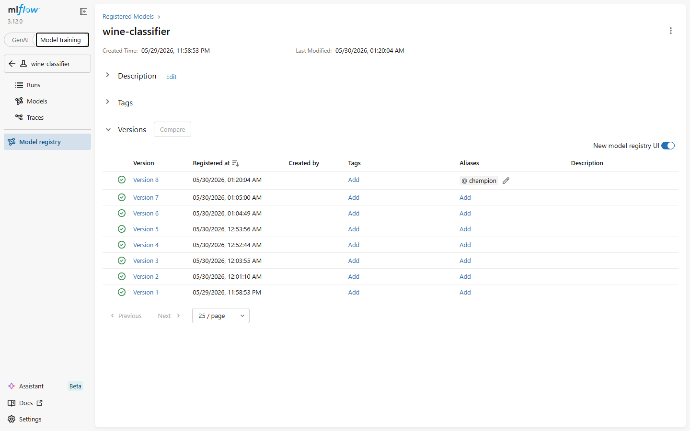
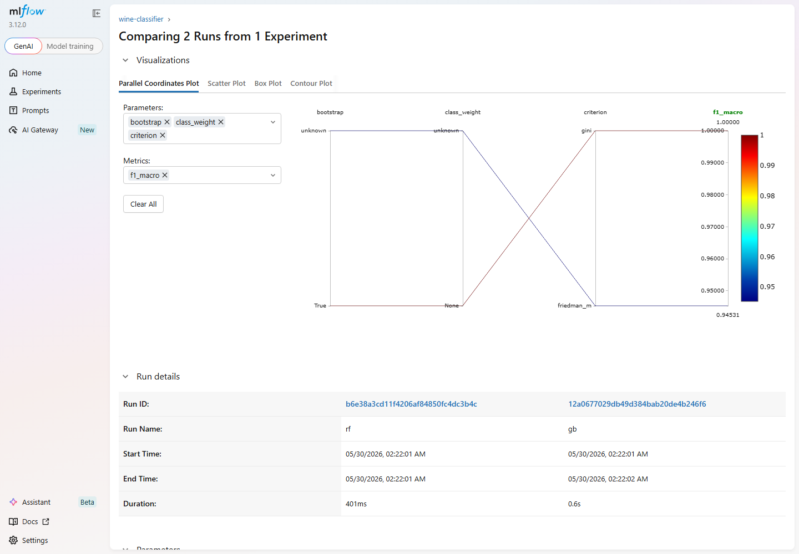
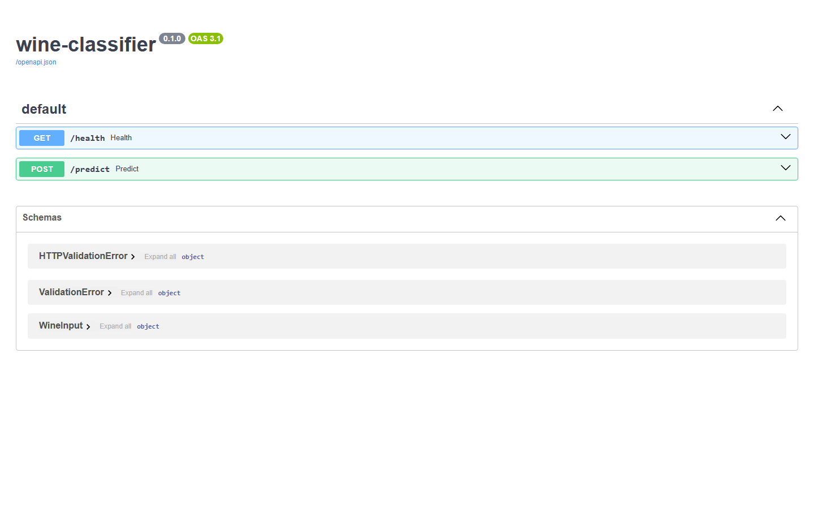
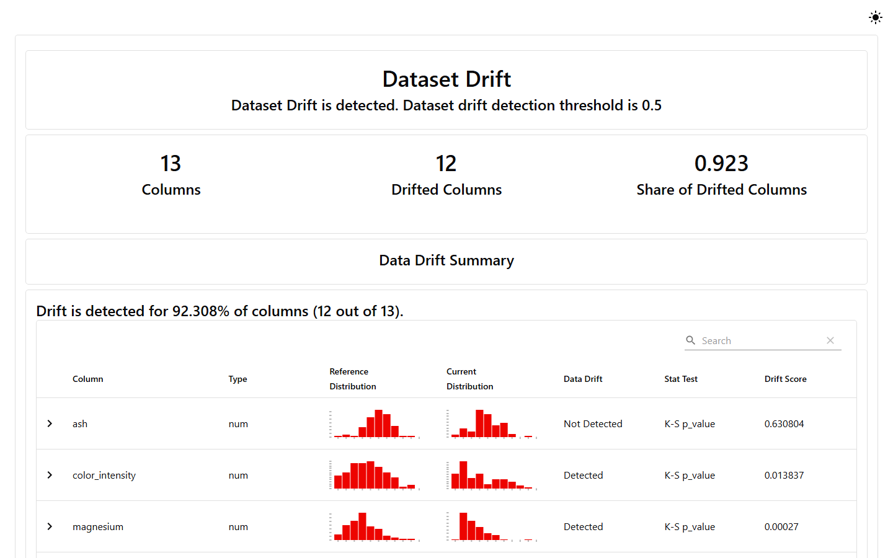
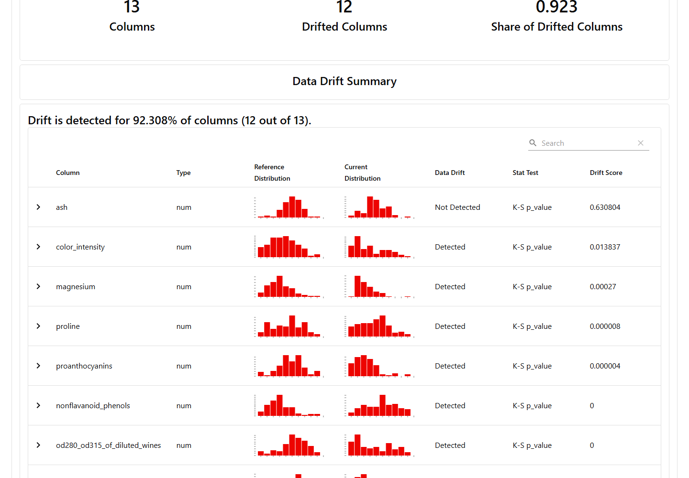

# Roteiro do curso — MLOps ponta a ponta (Wine Classifier)

Guia de **copiar e colar** para executar junto em aula. Tudo em **PowerShell**
(Windows). Cada passo traz o comando, a **saída esperada** e um ✅ **checkpoint**.

> **Sábado (Encontro 1):** `raw` → **data.py** → `processed` → **train.py** →
> Registry → **promote.py** → `@champion` → **FastAPI** → **Docker**
> **Domingo (Encontro 2):** CI/CD (Actions) · `docker compose` · drift (Evidently)
> · challenger × champion

## Convenções

- **Atalho — menu interativo:** em vez de copiar passo a passo, dá pra abrir o
  menu numérico e escolher cada etapa:
  `.\scripts_windows\start.ps1` (Windows) ou `./scripts_linux/start.sh` (Linux);
  com `make`: `make start-windows` / `make start-linux`.
- Substitua suas iniciais uma vez. Defina a variável no início do terminal:
  ```powershell
  $INICIAIS = "gilvanvmj"   # <- troque pelas suas iniciais
  ```
- **Dois terminais**: Terminal **1** roda o servidor MLflow (fica ocupado);
  Terminal **2** roda todo o resto.
- **Em TODO terminal**, antes de qualquer coisa, force UTF-8 (o MLflow imprime
  emojis e o console padrão do Windows quebra com `UnicodeEncodeError`):
  ```powershell
  $env:PYTHONIOENCODING = "utf-8"
  ```

---

# Parte 1 — Sábado (Encontro 1)

## 0. Pré-requisitos (uma vez por máquina)

```powershell
# uv (gerenciador de pacotes/projetos Python)
irm https://astral.sh/uv/install.ps1 | iex

# gh (GitHub CLI)
winget install --id GitHub.cli --accept-package-agreements --accept-source-agreements

# Git e Docker Desktop: instalar dos sites oficiais, se ainda não tiver.
```

> Linux/macOS: `curl -LsSf https://astral.sh/uv/install.sh | sh`

✅ **Checkpoint — versões mínimas:**
```powershell
uv --version              # 0.5+
uv python install 3.11    # baixa o interpretador se faltar
git --version             # 2.40+
docker --version          # 24+
docker compose version    # v2.20+
gh --version              # opcional
```

---

## 1. Identidade Git + repositório no GitHub

```powershell
git config --global user.name  "Gilvan Veras"
git config --global user.email "gilvanvmj@gmail.com"

gh auth login
gh auth status

# padrão do nome do repo: <iniciais>-mlops-icev
gh repo create "$INICIAIS-mlops-icev" --public --clone
cd "$INICIAIS-mlops-icev"
```

✅ **Checkpoint:** você está dentro da pasta `gilvanvmj-mlops-icev`.

---

## 2. Bootstrap do projeto com uv (uma única vez)

> ⚠️ `uv init` roda **uma vez só**. Se o `gh repo create --clone` já criou a
> pasta, use `uv init .` para inicializar **dentro** dela.

```powershell
uv init .
uv python pin 3.11

# dependências de runtime
uv add scikit-learn pandas pyarrow mlflow fastapi uvicorn dvc evidently
# dependências de desenvolvimento
uv add --dev pytest ruff

# .gitignore
@"
.venv/
__pycache__/
.pytest_cache/
.ruff_cache/
"@ | Set-Content -Encoding utf8 .gitignore

uv run python -c "import sklearn; print('sklearn', sklearn.__version__)"
```

✅ **Checkpoint — ambiente:**
```powershell
uv run dvc --version    ; if ($?) { "OK dvc" }
uv run mlflow --version ; if ($?) { "OK mlflow" }
uv run python -c "import fastapi, uvicorn, evidently; print('OK fastapi+uvicorn+evidently')"
```

```powershell
git add pyproject.toml uv.lock .gitignore README.md
git commit -m "chore: init uv project and lock dependencies"
git push -u origin main
```

---

## 3. Dados versionados com DVC

```powershell
uv run dvc init

# remote local (pasta no disco). No Windows usamos uma pasta de verdade:
$REMOTE = "$env:USERPROFILE\dvcstore"
New-Item -ItemType Directory -Force $REMOTE | Out-Null
uv run dvc remote add -d local $REMOTE

# gera o dataset BRUTO a partir do scikit-learn (nomes originais, com '/')
New-Item -ItemType Directory -Force data\raw | Out-Null
uv run python -c "from sklearn.datasets import load_wine; import pandas as pd; w=load_wine(as_frame=True); pd.concat([w.data, w.target.rename('y')], axis=1).to_parquet('data/raw/wine.parquet')"

# versiona o RAW com DVC (o processed será saída do pipeline, não se faz add nele)
uv run dvc add data/raw/wine.parquet
uv run dvc push

git add data/raw/wine.parquet.dvc data/raw/.gitignore .dvc/ .dvcignore
git commit -m "feat: bootstrap dvc + wine raw v1"
git push
```

✅ **Checkpoint:** existe `data/raw/wine.parquet` e `data/raw/wine.parquet.dvc`.

---

## 4. Etapa de dados: `src/data.py`

Cria `src/data.py` (já está no repositório de referência). Ele lê o raw,
**normaliza os nomes das colunas** (`od280/od315...` → `od280_od315...`,
porque `/` não é nome de campo válido na API) e grava o processed.

```powershell
uv run python src/data.py
```

✅ **Saída esperada:**
```
[data] data\raw\wine.parquet -> data\processed\wine.parquet  shape=(178, 14)
```

---

## 5. Pipeline declarativo com `dvc.yaml`

O `dvc.yaml` encadeia `data → train`. `dvc repro` só re-executa o que mudou.

```powershell
uv run dvc repro data
```

✅ **Checkpoint:** `data/processed/wine.parquet` existe (saída do estágio `data`).

> O estágio `train` precisa do servidor MLflow no ar (próximo passo), então o
> rodaremos depois.

---

## 6. Tracking Server do MLflow — **Terminal 1**

```powershell
$env:PYTHONIOENCODING = "utf-8"
uv run mlflow server --host 127.0.0.1 --port 5000 `
    --backend-store-uri sqlite:///mlflow.db `
    --artifacts-destination ./mlartifacts `
    --serve-artifacts
```

> No PowerShell a quebra de linha é a **crase** (`` ` ``), **não** o `^` do cmd.
> Deixe este terminal aberto. UI em <http://127.0.0.1:5000>.

✅ **Checkpoint:** abra <http://127.0.0.1:5000> — a UI do MLflow carrega.

---

## 7. Treino instrumentado: `src/train.py` — **Terminal 2**

```powershell
$env:PYTHONIOENCODING = "utf-8"
$env:MLFLOW_TRACKING_URI = "http://127.0.0.1:5000"

uv run python src/train.py
```

`train.py` lê o processed, treina um **Pipeline** (StandardScaler +
RandomForest), loga params/métrica e **registra** o modelo como
`wine-classifier`.

✅ **Saída esperada (algo como):**
```
[train] run_id=...  f1_macro=1.0000
🏃 View run rf-pipeline at: http://127.0.0.1:5000/#/experiments/1/runs/...
```

> Na UI, em **Models**, aparece `wine-classifier` com uma nova versão.



*Run `rf-pipeline`: hiperparâmetros logados (`n_estimators`, `max_depth`…),
métrica `f1_macro` e o modelo registrado como `wine-classifier` (v8).*

---

## 8. Promover o Champion: `src/promote.py`

Registrar **não** põe em produção. O serving carrega
`models:/wine-classifier@champion` — e esse alias só existe se promovermos.

```powershell
uv run python src/promote.py          # promove a melhor versão por f1_macro
# ou: uv run python src/promote.py 5   # força uma versão específica
```

✅ **Saída esperada:**
```
[promote] wine-classifier@champion -> v5  (f1_macro=1.0)
```



*Registry do `wine-classifier`: as versões registradas e o alias **`@champion`**
na versão promovida — é exatamente o que o serving carrega.*

---

## 9. (Opcional, interativo) Comparar runs no notebook

```powershell
uv run jupyter lab   # ou abra notebooks/01_mlflow_explore.ipynb no VS Code
```

O notebook treina `rf` e `gb` como **versões do mesmo** `wine-classifier`,
compara na UI (selecione os 2 runs → **Compare**) e mostra como promover.



*Tela **Compare** do MLflow: Parallel Coordinates ligando hiperparâmetros à
métrica `f1_macro`, e a tabela com os dois runs (`rf` × `gb`) lado a lado.*

---

## 10. Microsserviço FastAPI: `src/api/main.py` — **Terminal 2**

Com o servidor MLflow (Terminal 1) e o `@champion` definidos:

```powershell
$env:MLFLOW_TRACKING_URI = "http://127.0.0.1:5000"
uv run uvicorn src.api.main:app --host 127.0.0.1 --port 8000 --reload
```

✅ **Em outro terminal**, teste:
```powershell
# health
curl.exe http://127.0.0.1:8000/health
# {"status":"ok"}

# predict (13 features)
curl.exe -X POST http://127.0.0.1:8000/predict `
  -H "Content-Type: application/json" `
  -d '{\"alcohol\":13.0,\"malic_acid\":2.0,\"ash\":2.3,\"alcalinity_of_ash\":15.6,\"magnesium\":120,\"total_phenols\":2.8,\"flavanoids\":3.0,\"nonflavanoid_phenols\":0.3,\"proanthocyanins\":2.0,\"color_intensity\":5.0,\"hue\":1.0,\"od280_od315_of_diluted_wines\":3.0,\"proline\":1000}'
# {"prediction":0}
```

> Use `curl.exe` (não o alias `curl` do PowerShell) ou abra a UI em
> <http://127.0.0.1:8000/docs>.



*Documentação OpenAPI gerada automaticamente em `/docs`: `GET /health`,
`POST /predict` e o schema `WineInput` (13 features).*

---

## 11. Empacotar em Docker

```powershell
docker build -t "$INICIAIS/wine-classifier:0.1.0" .

# o container fala com o MLflow do HOST via host.docker.internal
docker run --rm -p 8000:8000 `
  -e MLFLOW_TRACKING_URI="http://host.docker.internal:5000" `
  "$INICIAIS/wine-classifier:0.1.0"
```

✅ **Em outro terminal:**
```powershell
curl.exe http://localhost:8000/health   # {"status":"ok"}
```

> O `MLFLOW_TRACKING_URI` já tem default `host.docker.internal:5000` no
> Dockerfile; o `-e` acima é explícito para deixar claro em aula.

---

## 12. Commit final

```powershell
git add src/ dvc.yaml Dockerfile .dockerignore notebooks/ ROTEIRO.md pyproject.toml uv.lock
git commit -m "feat: pipeline mlops ponta a ponta (data, train, promote, serving, docker)"
git push
```

---

# Parte 2 — Domingo (Encontro 2)

Continua no **mesmo repositório**. Fecha o ciclo de MLOps: CI/CD, deploy com
compose, monitoramento de drift e ciclo de vida (challenger × champion).

## 13. CI local (espelha o GitHub Actions)

O `.github/workflows/ci.yml` roda a cada push/PR: job `quality` (lint + testes)
e, na `main`, `build-and-push` da imagem para o GHCR. Rode os mesmos gates local:

```powershell
uv run ruff check .
uv run pytest -q
```

✅ **Saída esperada:** `All checks passed!` e `N passed`.

> O `build-and-push` usa `secrets.GITHUB_TOKEN` (automático) e publica duas tags:
> `:latest` e `:${{ github.sha }}`.

---

## 14. Deploy local com `docker compose` (MLflow + API)

```powershell
docker compose up --build
```

Sobe os dois serviços: MLflow em :5000 e a API em :8000. A API só inicia quando
o MLflow fica saudável (`depends_on: condition: service_healthy`).

✅ **Em outro terminal:** `curl.exe http://localhost:8000/health` → `{"status":"ok"}`.
Derrubar: `docker compose down`.

---

## 15. Monitoramento: Data Drift com Evidently

A API grava **cada predição** em `logs/predictions.jsonl` (request_id, timestamp,
modelo, payload, predição, latência) — matéria-prima do monitoramento. O
`src/monitor.py` compara treino × "produção" e gera o relatório:

```powershell
uv run python src/monitor.py
```

✅ **Saída esperada:** `relatorio de drift salvo em reports\drift_report.html`.
Abra o HTML para inspecionar o drift por feature.



*Evidently: **drift detectado** em 12 de 13 features (share 0.923) — veredito geral.*



*Detalhe por feature: cada coluna com distribuição referência × atual, veredito
(`Detected`/`Not Detected`), teste estatístico (K-S) e *drift score*.*

---

## 16. Ciclo de vida: challenger × champion

```powershell
$env:MLFLOW_TRACKING_URI = "http://127.0.0.1:5000"
uv run python src/evaluate.py        # compara a versão mais recente com o @champion
```

✅ **Saída esperada (exemplo):**
```
[evaluate] champion   v8: f1_macro=1.0000
[evaluate] challenger v9: f1_macro=0.9800
[evaluate] RECOMENDACAO: manter o champion (challenger nao superou).
```

Se o challenger vencer, promova-o: `uv run python src/promote.py <versão>` —
ele vira o novo `@champion`.

---

## 17. Commit de domingo

```powershell
git add .github/ docker-compose.yml src/monitor.py src/evaluate.py tests/ `
        scripts_windows/ scripts_linux/ Makefile
git commit -m "feat: ci/cd, compose, monitoramento (drift) e ciclo de vida"
git push
```

---

## Estrutura final do repositório

```
gilvanvmj-mlops-icev/
├── data/
│   ├── raw/wine.parquet            # fonte (DVC add)
│   └── processed/wine.parquet      # saída do estágio 'data' (DVC pipeline)
├── src/
│   ├── data.py                     # raw -> processed (limpa nomes)
│   ├── train.py                    # processed -> MLflow Registry
│   ├── promote.py                  # melhor versão -> @champion
│   ├── evaluate.py                 # challenger × champion (ciclo de vida)
│   ├── monitor.py                  # Data Drift (Evidently)
│   └── api/main.py                 # serving FastAPI + log de predições
├── tests/                          # testes mínimos (gate do CI)
├── notebooks/01_mlflow_explore.ipynb
├── scripts_windows/  ·  scripts_linux/   # passo a passo 00–14 + start (menu)
├── .github/workflows/ci.yml        # CI: quality (lint+test) + build-push GHCR
├── dvc.yaml                        # data -> train
├── Dockerfile  ·  docker-compose.yml   # imagem + stack local (MLflow + API)
├── Makefile                        # atalhos (start-windows/-linux, ci, drift…)
├── pyproject.toml / uv.lock
├── logs/predictions.jsonl          # log de predições (gerado pela API)
├── reports/drift_report.html       # relatório de drift (gerado por monitor.py)
└── mlflow.db / mlartifacts/        # backend + artefatos do MLflow (local)
```

## Tabela de armadilhas (resolvidas neste roteiro)

| Sintoma | Causa | Correção |
|---|---|---|
| `UnicodeEncodeError: '\U0001f3c3'` | console cp1252 + emoji do MLflow | `$env:PYTHONIOENCODING="utf-8"` (e guard no `train.py`) |
| `feature names should match` no `/predict` | modelo treinado com `od280/od315...` (barra) | `data.py` normaliza `/`→`_` na origem |
| `RESOURCE_DOES_NOT_EXIST` ao subir a API | alias `@champion` nunca criado | rodar `src/promote.py` |
| `ModuleNotFoundError: src` | rodar fora da raiz do projeto | rodar tudo de dentro de `<iniciais>-mlops-icev` |
| linha de comando com `^` não quebra | `^` é do `cmd`, não do PowerShell | usar crase `` ` `` |
| modelo não acha artefato (`mlflow-artifacts:`) | tracking URI apontando pro SQLite | usar o **servidor** `http://127.0.0.1:5000` |
| `report.save_html()` falha no Evidently 0.7 | a API mudou na 0.7 | `snapshot = report.run(...)` e `snapshot.save_html(...)` |
| `&&` / `\|\|` dá erro no PowerShell 5.1 | são operadores do `cmd`/bash | usar `;` + `if ($?) { ... }` |
| `pytest` "no tests ran" (exit 5) trava o CI | nenhum teste coletado | há `tests/` com testes mínimos |
